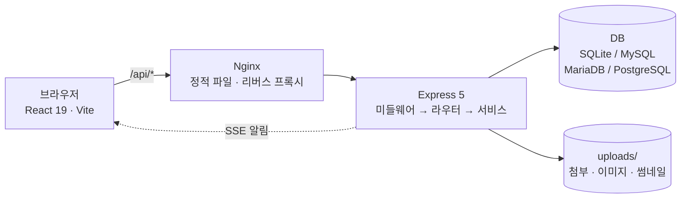
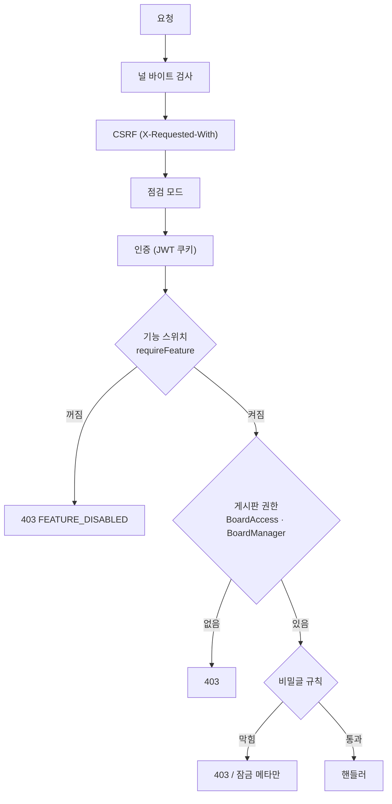
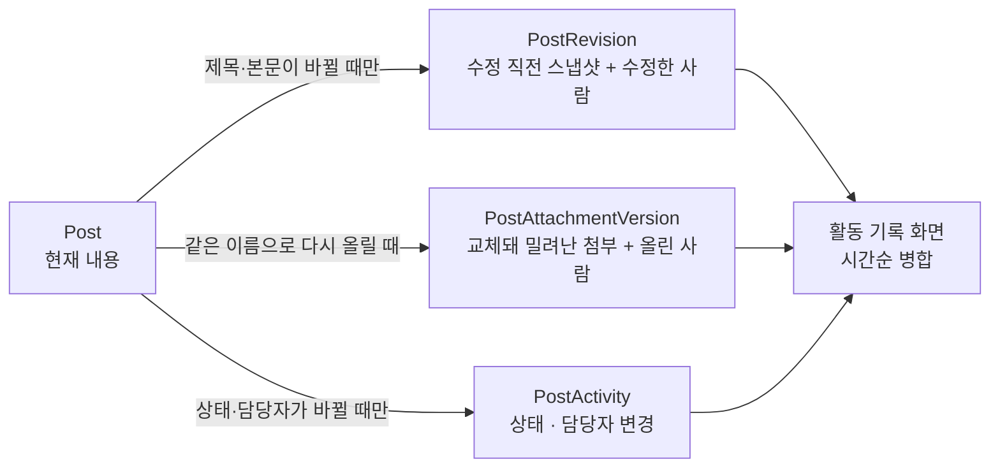
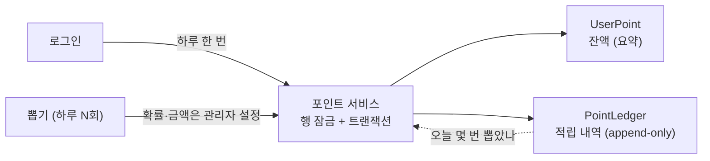

# TinyCommunity

React + Express 기반의 풀스택 커뮤니티/게시판 플랫폼. SQLite·MySQL·MariaDB·PostgreSQL을 지원합니다.

[](https://github.com/zz1231me/tinycommunity/actions/workflows/ci.yml)

- [주요 기능](#주요-기능)
- [기술 스택](#기술-스택)
- [빠른 시작](#빠른-시작)
- [프로젝트 구조](#프로젝트-구조)
- [환경변수](#환경변수)
- [데이터베이스](#데이터베이스)
- [아키텍처](#아키텍처)
- [API](#api)
- [Docker 배포](#docker-배포)
- [보안](#보안)
- [개발](#개발)
- [트러블슈팅](#트러블슈팅)

---

## 주요 기능

- **인증·권한**: JWT(HttpOnly 쿠키, 자동 갱신), 2FA(TOTP), 역할 기반 접근제어(RBAC), 관리자 비밀번호 초기화→강제 변경, 기기별 세션 관리, 멀티탭 자동 로그아웃
- **게시판**: 권한별 다중 게시판, CKEditor 5 에디터, 파일 첨부·이미지 인라인 업로드, 중첩 댓글·좋아요·이모지 반응, 태그, 비밀글(비밀번호·지정 사용자·E2EE), 기간 지정 상단 고정, 읽음 표시, 북마크, 임시저장, 수정 이력·Diff, 게시판 간 이동, 삭제 후 보관 기간 경과 시 자동 영구삭제
- **업무용 게시판**: 게시판별 '업무용' 전환, 글마다 담당자·진행 상태(할 일·진행 중·완료), 상태별 목록 필터, '내 업무' 모아 보기, 관리자 지정 상태 이름
- **증적 관리**: 본문 안 문단별 첨부 참조, 같은 이름으로 재업로드 시 이전 파일 개정 이력 보관, 읽음 확인(작성자·게시판 담당자만), 작성·수정·첨부 교체·상태 변경 통합 활동 기록
- **소통·탐색**: 다이렉트 메시지, 게시판·사용자 구독, 사용자 프로필, 인기글·관련 글·태그 클라우드, 스크랩, 실시간 알림(SSE, 폴링 폴백), @멘션, 전역 검색(⌘K)
- **위키**: 슬러그 기반 계층 페이지, 리비전·Diff, 발행/비발행
- **커스텀 페이지**: 관리자가 만드는 독립 페이지 — HTML 직접 작성 또는 정적 사이트 ZIP 번들 업로드(샌드박스 iframe 서빙), 사이드바 노출
- **메모·캘린더**: 사용자별 스티키 메모(색상·고정·드래그 정렬), FullCalendar 기반 일정(드래그&드롭, 역할별 권한)
- **포인트**: 하루 한도 내 뽑기와 접속 시 출석 포인트, 상위 10명 순위와 내 자리, 포인트를 걸고 겨루는 1:1 가위바위보 대결(신청하는 순간 포인트를 맡기고, 승부와 정산을 한 트랜잭션으로 끝내며, 답이 없는 판은 자동 환불), 관리자 지정 확률·금액·횟수·출석량·판돈 범위, 서버 전용 추첨, 잔액과 별개로 남는 적립 원장
- **출퇴근**: 하루 한 번 출근·퇴근 기록(초를 버리고 분 단위로 저장), 출근 시 체크리스트, 근무 시간 집계와 개인 통계, 헤더의 출근 아이콘(아직 안 찍었으면 눈에 띄게 표시), 출근 알림창과 퇴근 알림창(퇴근은 10분 전·정각·3분 뒤 세 번), 관리자 지정 기준 근무시간·안내 문구·출근 시각 보정(컴퓨터를 켜는 시간만큼 앞당겨 기록, 기본 0분)
- **퇴근 공격**: 포인트로 사는 두 가지 방해 — *퇴근 방해*(기본 1분, 버튼이 도망다니고 깜빡이지만 끝까지 누르면 눌린다)와 *버튼 숨기기*(기본 10초, 그동안은 버튼이 아예 없다). 받은 쪽은 방어권으로 즉시 해제. 숨기기만 실제로 누를 수 없는 시간이 생기므로 짧게 두고 서버가 3~60초로 상한을 막는다. 어느 쪽이든 **기록되는 퇴근 시각은 언제나 실제로 누른 순간** 그대로다 — 남이 남의 근무 기록을 늦출 수 없다. 공격권을 사는 곳은 마이페이지의 포인트 탭이고, 받는 쪽 화면(경고 띠·도망가는 버튼)은 출퇴근 화면에 있다
- **관리자**: 기능 스위치 27종(기능별 on/off, 의존성 자동 해소), 사용자·게시판·역할·태그·이벤트 관리, 테마(브랜드 색 계단 자동 생성), 보안/에러/감사/로그인 로그, 신고·IP 규칙·사이트 설정
- **UI**: 라이트·다크·드라큘라 테마, 프로필 아바타, 반응형, 댓글 가상 스크롤

---

## 기술 스택

**Frontend** — React 19, TypeScript 6, Vite 8(Rolldown), Tailwind CSS 4, Zustand 5, React Query 5, React Router 7, CKEditor 5(48), FullCalendar 6, Uppy 5, Framer Motion 12, TanStack Virtual 3, DOMPurify 3, Vitest 5

**Backend** — Express 5, TypeScript 6, Sequelize 6, jsonwebtoken 9, bcryptjs 3, Speakeasy 2(2FA), Multer 2, Sharp(아바타·썸네일), Zod 4, Helmet 8, Jest 30. 로깅은 외부 라이브러리 없이 `utils/logger.ts` 자체 구현입니다.

**Database** — SQLite(기본) / MySQL / MariaDB / PostgreSQL

---

## 빠른 시작

**요구사항**: Node.js 20.x 이상, npm 9.x 이상.

```bash
# 1. 클론
git clone https://github.com/zz1231me/tinycommunity.git
cd tinycommunity

# 2. 서버 (http://localhost:4000)
cp server/.env.sample server/.env   # JWT_SECRET 등 시크릿 변경
cd server && npm install && npm run dev

# 3. 클라이언트 (새 터미널, http://localhost:8080)
cd client && npm install && npm run dev
```

| 서비스                  | URL                            |
| ----------------------- | ------------------------------ |
| 클라이언트              | http://localhost:8080          |
| API 서버                | http://localhost:4000          |
| API 문서 (Swagger, dev) | http://localhost:4000/api-docs |

- 기본 DB는 **SQLite**라 별도 설치가 필요 없습니다. 첫 실행 시 테이블·기본 데이터(admin 계정·역할·사이트 설정)가 자동 생성됩니다.
- **초기 로그인**: ID `admin`, 비밀번호는 `server/.env`의 `ADMIN_DEFAULT_PASSWORD`. 로그인 후 반드시 변경하세요.
- Windows에서 기본 명령(`npm run dev/build/test`)은 PowerShell/cmd에서 동작합니다. 보조 스크립트에 문제가 있으면 Git Bash/WSL2를 사용하세요.

---

## 프로젝트 구조

```
tinycommunity/
├── client/                 # React + Vite
│   └── src/                # api · components · pages · hooks · store · contexts · providers
│                           # · constants · styles · types · utils · test
├── server/                 # Express + Sequelize
│   └── src/                # config · controllers · middlewares(+upload) · models · routes
│                           # · services · types · utils · validators
│       ├── __tests__/      # Jest (OS 임시 폴더의 SQLite 파일, 프로세스별)
│       └── scripts/        # DB 시드/인덱스 스크립트
├── server/.env.sample      # 환경변수 템플릿
├── docker-compose.yml      # MariaDB + App + Nginx
├── Dockerfile              # 멀티스테이지 빌드
└── nginx.conf              # 리버스 프록시
```

---

## 환경변수

`server/.env.sample`을 `server/.env`로 복사해 사용합니다. 파일 업로드 한도 등 운영 설정은 환경변수가 아니라 **관리자 → 사이트 설정**에서 DB 기반으로 관리됩니다.

| 변수                                                       | 기본값              | 설명                                                    |
| ---------------------------------------------------------- | ------------------- | ------------------------------------------------------- |
| `NODE_ENV`                                                 | `development`       | `production`이면 시크릿 검증·보안 헤더·쿠키 Secure 강화 |
| `PORT`                                                     | `4000`              | API 서버 포트                                           |
| `JWT_SECRET`                                               | —                   | **필수**. 액세스 토큰 서명 키(프로덕션 32자 이상)       |
| `JWT_REFRESH_SECRET`                                       | —                   | **필수**. 리프레시 토큰 키(`JWT_SECRET`과 달라야 함)    |
| `ADMIN_DEFAULT_PASSWORD`                                   | `ChangeMe_2024!`    | 초기 admin 비밀번호(프로덕션은 약한 값 부팅 차단)       |
| `COOKIE_SECURE`                                            | 프로덕션 `true`     | 인증 쿠키 Secure 플래그. HTTP 인트라넷은 `false`        |
| `DB_TYPE`                                                  | `sqlite`            | `sqlite` / `mysql` / `mariadb` / `postgresql`           |
| `DB_STORAGE`                                               | `./database.sqlite` | SQLite 파일 경로                                        |
| `DB_HOST`·`DB_PORT`·`DB_USER`·`DB_PASSWORD`·`DB_NAME`      | —                   | 非 SQLite 접속 정보                                     |
| `DB_SSL` / `DB_SSL_CA`                                     | `false` / —         | DB SSL 및 CA 인증서                                     |
| `ALLOWED_ADMIN_IPS`                                        | (미설정=전체 허용)  | 관리자 API 허용 IP(쉼표 구분)                           |
| `CORS_ORIGINS`                                             | —                   | CORS 허용 오리진(쉼표 구분)                             |
| `CORS_ALLOW_ALL` / `CORS_IP_PATTERN`                       | `false` / —         | 전체 허용 / 사설망 오리진 정규식(인트라넷 배포용)       |
| `SECURITY_LOG_RETENTION_DAYS` / `ERROR_LOG_RETENTION_DAYS` | `90` / `30`         | 로그 보존 기간(일)                                      |

---

## 데이터베이스

기본값은 **SQLite**입니다. 다른 DB로 전환하려면 [DATABASE_SETUP_GUIDE.md](./DATABASE_SETUP_GUIDE.md)를 참고하세요. 모든 드라이버는 `optionalDependencies`로 포함되어 `npm install`에 함께 설치됩니다.

테이블 스키마는 서버 첫 실행 시 Sequelize `sync`로 자동 생성됩니다. 이미 만들어진 테이블에는
부팅 시 누락된 컬럼을 보강하고(모든 드라이버), 값이 늘어나는 ENUM 컬럼(알림 종류·테마)은
문자열로 넓힙니다. 타입·제약 변경은 자동으로 따라가지 않습니다([아키텍처](#아키텍처) 참고).

---

## 아키텍처



요청은 항상 같은 순서로 검사를 거칩니다. 앞 단계에서 막히면 뒤는 실행되지 않습니다.



**권한은 네 겹입니다.** 하나라도 막으면 열리지 않습니다. 화면에서 감추는 것은 편의이고,
판정은 서버가 합니다.

| 겹            | 무엇을 정하는가                                | 저장 위치                                                  |
| ------------- | ---------------------------------------------- | ---------------------------------------------------------- |
| 기능 스위치   | 이 기능을 사이트에서 쓰는가                    | `FeatureFlag` (관리자 → 기능 설정)                         |
| 게시판 권한   | 이 역할이 이 게시판을 읽고/쓰고/지울 수 있는가 | `BoardAccess` (역할별)                                     |
| 게시판 담당자 | 이 사람이 이 게시판을 관리하는가               | `BoardManager` (사용자별)                                  |
| 글 단위 규칙  | 비밀글·개인공간·업무용 여부                    | `Post.isSecret` · `Board.isPersonal` · `Board.taskEnabled` |

기본 역할은 `admin` / `manager` / `user` / `guest`입니다(앞 세 개는 삭제 불가). 관리자 페이지에서
커스텀 역할을 만들고 게시판별 권한을 부여합니다. 이벤트는 `EventPermission`, 위키는 역할 목록으로
따로 관리합니다. 비활성 게시판은 admin/manager와 그 게시판 담당자 외에는 열리지 않습니다.

**데이터 모델** (Sequelize, 49개)

| 도메인             | 모델                                                                                          |
| ------------------ | --------------------------------------------------------------------------------------------- |
| 인증·사용자        | `User` `Role` `UserSession` `LoginHistory` `PasswordResetRequest`                             |
| 게시판             | `Board` `BoardAccess` `BoardManager`                                                          |
| 게시글             | `Post` `PostDraft` `PostTag` `PostRead` `PostLike` `PostScrap` `Bookmark`                     |
| 게시글 이력        | `PostRevision` `PostAttachmentVersion` `PostActivity`                                         |
| 댓글               | `Comment` `CommentLike` `CommentReaction`                                                     |
| 소통               | `Conversation` `Message` `Subscription` `NotificationSetting` `Notification`                  |
| 위키·메모          | `WikiPage` `WikiRevision` `Memo`                                                              |
| 이벤트             | `Event` `EventPermission`                                                                     |
| 태그·신고          | `Tag` `Report`                                                                                |
| 커스텀 콘텐츠·공유 | `CustomPage` `Announcement` `TempShare`                                                       |
| 포인트             | `UserPoint` `PointLedger`                                                                     |
| 출퇴근             | `AttendanceRecord` `AttendancePolicy` `AttendanceChecklistItem`                               |
| 운영·보안          | `SiteSettings` `FeatureFlag` `IpRule` `SecurityLog` `ErrorLog` `AuditLog` |

**글 하나에 남는 기록** — 세 테이블에 나뉘어 쌓이고, 활동 기록 화면이 시간순으로 합칩니다.
같은 내용을 두 곳에 적지 않습니다.



- `Post`·`Comment`은 soft-delete(`paranoid`)입니다. 이력 테이블은 append-only로, 한 번 적은 줄은 고치지 않습니다.
- 글을 지우면 자식(댓글·좋아요·조회기록·태그·알림)을 한 트랜잭션으로 정리하고 파일도 그 시점에 삭제합니다.
  DB 기록만 보관 기간 동안 남았다가 만료되면 영구 삭제됩니다(첨부의 이전 버전 파일도 함께).
- 첨부는 `Post.attachments`에 JSON으로 저장하고, 실제 파일은 확장자를 제거한 무작위 이름으로 `uploads/files`에 둡니다.

**포인트 적립 흐름** — 잔액(`UserPoint`)은 조회용 요약이고 실제 내역은 원장(`PointLedger`)에 있습니다.
둘은 항상 같은 트랜잭션에서 함께 갱신됩니다(테스트가 잔액 = 원장 합계를 고정합니다).



추첨은 서버에서만 이뤄지고 `crypto` 난수를 씁니다. 화면이 보낸 값은 결과에 관여하지 않습니다.
꽝도 원장에 한 줄 남깁니다. 하루 뽑기 횟수를 이 기록으로 세기 때문입니다.

**스키마 변경 방식** — `sync({alter:false})` + 부팅 시 컬럼 보강입니다. 새 컬럼은 자동으로 따라가고,
값이 늘어나는 ENUM 컬럼은 부팅 시 문자열로 넓힙니다. 타입·제약 변경은 따라가지 않습니다.

**인덱스는 새로 만드는 테이블에만 `sync` 가 만듭니다.** 이미 있는 테이블에는 모델에 인덱스를 적어도
생기지 않으므로(`alter:false`), 부팅 시 함께 도는 `server/src/scripts/add-indexes.ts` 목록에도 넣어야
기존 설치에 적용됩니다. 운영 DB에서 타입을 바꿔야 할 때는 별도 마이그레이션이 필요합니다.

---

## API

개발 모드에서 Swagger UI(`http://localhost:4000/api-docs`)로 전체 문서를 확인할 수 있습니다.

실시간 알림은 `GET /api/notifications/stream`(SSE)로 전달되며, 스트림이 끊기면 클라이언트가 폴링으로 자동 폴백합니다. 앱을 여러 프로세스로 띄우면 다른 프로세스가 만든 알림은 폴링 주기로만 도착합니다.

엔드포인트(전체): `/api/auth` · `/api/2fa` · `/api/boards` · `/api/board-managers` · `/api/posts` · `/api/comments` · `/api/messages` · `/api/social` · `/api/events` · `/api/memos` · `/api/wiki` · `/api/tags` · `/api/notifications` · `/api/users` · `/api/bookmarks` · `/api/drafts` · `/api/reports` · `/api/points` · `/api/attendance` · `/api/announcements` · `/api/custom-pages` · `/api/temp-share` · `/api/features` · `/api/site-settings` · `/api/admin` · `/api/uploads`

포인트 대결은 `/api/points/duels`, 퇴근 공격은 `/api/attendance/attack` 아래에 있습니다.
둘 다 기능 스위치(`tools.pointDuel`, `tools.attendanceAttack`)가 꺼져 있으면 서버가 403으로 막습니다 —
화면에서 버튼을 숨기는 것과 별개입니다.

글 상세(`GET /api/posts/:boardType/:id`)는 화면이 바로 그릴 수 있도록 태그와 보는 사람의
상태(좋아요·스크랩·관리 권한)를 함께 반환합니다. 따로 조회하면 글 하나를 여는 데 왕복이 넷이 됩니다.

---

## Docker 배포

`docker-compose`는 MariaDB + App(Node) + Nginx를 함께 띄웁니다. 클라이언트 정적 파일은 이미지 빌드 시 포함됩니다.

```bash
# 프로젝트 루트 .env에 필수 시크릿 작성 (강한 값으로 교체)
cat > .env <<'EOF'
DB_PASSWORD=change-me
DB_ROOT_PASSWORD=change-me
JWT_SECRET=change-me-32-characters-minimum
JWT_REFRESH_SECRET=change-me-different-32-characters
ADMIN_DEFAULT_PASSWORD=change-me
EOF

docker-compose up -d --build      # 빌드 & 실행 (첫 실행 DB 초기화 ~30초)
docker-compose logs -f app        # 로그
docker-compose down               # 중지 (down -v = 데이터 포함 삭제)
```

`nginx.conf`는 기본적으로 내부 네트워크(192.168.x.x, 172.16.x.x)만 허용합니다. 공인 IP에서 접근하려면 해당 `allow`/`deny` 블록을 수정하세요.

> **주의 — 묶음의 `nginx.conf`는 호스트에 직접 설치하는 경우를 상정한 템플릿입니다.**
> 컨테이너로 띄우면 그대로는 동작하지 않습니다. `upstream`이 `127.0.0.1:4000`(컨테이너 안에서는
> nginx 자기 자신)을 가리키고 정적 파일 `root`가 `C:/myproject` 플레이스홀더라, nginx를 거친 요청은
> `/` 404 · `/api/` 502가 됩니다. `nginx -t`는 통과하므로 컨테이너는 정상 기동한 뒤 런타임에만
> 실패합니다. **앱 컨테이너 자체는 정상**이라 `http://<호스트>:4000`으로는 바로 접속됩니다.
> 컨테이너에서 nginx를 쓰려면 `upstream`을 `app:4000`으로, `$project_root`를 컨테이너 안 경로로
> 바꾼 별도 설정 파일이 필요합니다.

---

## 보안

- HttpOnly 쿠키 JWT + 2FA(TOTP), 로그아웃/비밀번호 변경 시 `tokenVersion`으로 기존 세션 즉시 무효화
- 무차별 대입 방지(로그인 15분 50회 — 성공한 로그인은 세지 않음 · 회원가입 1시간 10회 · 비밀글 비밀번호 5분 5회 · 2FA 5분 10회), IP 화이트리스트(Nginx + 앱)
- XSS 방지(클라 DOMPurify + 서버 sanitize-html), SQL Injection 방지(ORM 바인딩 + Zod), Helmet 보안 헤더, CSRF(X-Requested-With)
- **파일 업로드 하드닝**: 위험 확장자 절대 차단(정규화 우회 방지), 확장자 제거·무작위 파일명 저장, 실행 권한 제거(chmod 644), 첨부는 인가된 다운로드 경로에서 `attachment` + `nosniff`로만 제공(정적 서빙 우회 차단), 인라인 이미지 경로는 매직넘버 검증으로 저장형 XSS 방어
- 비밀번호 재설정 토큰 SHA-256 해싱, bcrypt 비밀번호 해싱, 프로덕션 시크릿 검증(약한 값 부팅 차단), 보안 이벤트 로깅

- **권한 경계 테스트**: 남의 글, 접근 권한이 없는 게시판, 남의 개인 자료(임시저장·메모·스크랩·대화),
  첨부 파일 직접 접근, 관리자 화면을 한 자리에 모아 읽기를 시도합니다
  (`server/src/__tests__/authorizationBoundary.test.ts`).
- 널 바이트가 섞인 주소는 입구에서 400으로 거절합니다. DB까지 내려가면 500이 되어 오류 로그를 채웁니다.

**배포 전 체크리스트**: `.env` 커밋 금지 · `JWT_SECRET`/`ADMIN_DEFAULT_PASSWORD` 강한 값으로 변경 · HTTPS 적용 · `ALLOWED_ADMIN_IPS` 설정 · `TZ=Asia/Seoul` 설정 · 정기 `npm audit`.

> **`TZ` 를 반드시 맞추세요.** MySQL/PostgreSQL 연결은 `+09:00` 으로 고정돼 있는데, '오늘'을
> 정하는 쪽(출퇴근의 근무일, 포인트 하루 한도)은 서버 프로세스의 로컬 시간을 봅니다. 호스트가
> UTC 면 둘이 아홉 시간 어긋나, 한국 시간 오전 아홉 시 전에 찍은 출근이 어제 날짜로 들어갑니다.
> 어긋나 있으면 기동할 때 경고가 뜹니다(SQLite 는 해당 없음).

---

## 개발

**로컬 검증 (CI 기준)**

```bash
cd server && npm run typecheck && npm run lint && npm run format:check && npm test
cd client && npm run typecheck && npm run lint && npm run format:check && npm test && npm run build
```

**주요 스크립트**

|           | 서버                      | 클라이언트                |
| --------- | ------------------------- | ------------------------- |
| 개발      | `npm run dev` (4000)      | `npm run dev` (8080)      |
| 빌드      | `npm run build` → `dist/` | `npm run build` → `dist/` |
| 실행      | `npm start`               | `npm run preview`         |
| 테스트    | `npm test` (Jest)         | `npm test` (Vitest)       |
| 타입검사  | `npm run typecheck`       | `npm run typecheck`       |
| 린트/포맷 | `npm run lint` · `format` | `npm run lint` · `format` |

서버 `typecheck`는 테스트 파일까지 검사합니다(`build`는 `dist`에 넣지 않으려고 테스트를 제외하고, jest 는 ts-jest `diagnostics:false` 라 타입을 보지 않습니다).

서버 보조 스크립트: `setup:{sqlite\|mysql\|mariadb\|postgresql}`(‧env 작성), `db:indexes`, `init:roles`.

**규칙**: TypeScript strict · ESLint + Prettier · 미사용 파라미터 `_` 접두사 · 로깅은 `logInfo()`/`logError()` · 응답은 `sendSuccess()`/`sendError()`.

---

## 트러블슈팅

**포트 충돌** — `lsof -i :4000`(Mac/Linux) 또는 `netstat -ano | findstr :4000`(Windows)로 확인. 서버 포트는 `server/.env`의 `PORT`, 클라이언트 API 대상은 `client/.env.local`의 `VITE_API_URL`로 변경.

**DB 초기화** — SQLite는 `rm server/database.sqlite` 후 재실행. 외부 DB는 `DROP DATABASE tinycommunity;` → `CREATE DATABASE tinycommunity;`.

**Docker Nginx 빈 화면 / 502** — 볼륨 문제가 아닙니다. `nginx.conf`가 호스트 설치용이라 컨테이너에서는
정적 파일 경로와 `upstream`이 둘 다 어긋납니다([Docker 배포](#docker-배포)의 주의 참고). 볼륨을 다시
만들어도 해결되지 않습니다. 당장 쓰려면 nginx를 거치지 말고 `http://<호스트>:4000`으로 접속하세요.

---

## 라이선스

MIT
